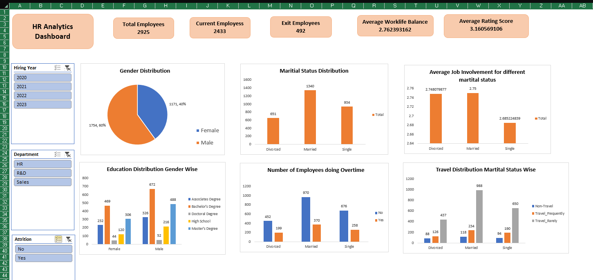

# Excel Data Analysis Portfolio


## Project preview



A portfolio of hands-on Excel data analysis and dashboard projects using sales, crime, employee, Olympics, and HR datasets.

## How to explore this project

Since GitHub does not fully preview Excel files, use the following options to review the work:

- 📊 **Quick preview:** Open the [`screenshots/`](screenshots/) folder to view dashboards and key outputs.
- 📁 **Explore files:** Browse the [`datasets/`](datasets/) and [`dashboards/`](dashboards/) folders for the source Excel workbooks.
- ⬇️ **Download and open:** Download the Excel files and open them in Microsoft Excel to interact with pivot tables, charts, and dashboards.

---

## What this repository demonstrates

- Real-world dataset projects across sales, crime, HR, and Olympics analysis
- End-to-end analysis workflows: data cleaning → transformation → insights
- Business-focused data thinking, not just formulas
- A fully developed HR dashboard with charts, slicers, and KPI summaries

---

## Projects included

### 1. Sales Data Analysis
- Cleaned raw sales data
- Used pivot tables to extract revenue and order trends
- Identified key business insights from sales performance

### 2. Crime Data Analysis
- Analyzed Boston crime records
- Explored patterns across districts and offense types
- Summarized trends for data-driven interpretation

### 3. Employee Data Analysis
- Processed an employee dataset
- Generated summaries and key operational metrics
- Built tables to support HR decision-making

### 4. Olympics Data Analysis
- Worked on a historical Olympics dataset
- Extracted country-level and event-level insights
- Analyzed performance trends across editions

### 5. HR Dashboard
- Built an interactive Excel dashboard
- Visualized employee KPIs with charts and slicers
- Applied clean formatting for readability and insight

---

## Key skills gained

- Data cleaning and preparation
- Pivot tables and pivot charts
- Data visualization
- Dashboard design
- Working with multiple datasets
- Extracting business insights from raw data

---

## Repo structure

```
excel-data-analysis-projects/
│
├── datasets/
│ ├── sales/
│ ├── crime/
│ ├── employees/
│ ├── olympics/
│ └── hr/
│
├── dashboards/
│ └── hr_dashboard.xlsx
│
├── screenshots/
│ 
│
└── README.md

```
---

## Tools used

- Microsoft Excel
- Pivot tables
- Charts and graphs
- Dashboard components (slicers, formatting)

---

## Credits

This learning journey was guided by the course from **CampusX**:  
🔗 https://learnwith.campusx.in/

---

## What’s next

- Move to **SQL for data querying**
- Learn **Python (Pandas, NumPy) for advanced analysis**
- Build **Power BI dashboards**
- Work on **end-to-end data projects**

---

## About the author

Rushit Tholiya — 2nd year B.Tech (Computer Science) at Nirma University, Ahmedabad

Currently building skills in data analysis and preparing for a career in **data science / data analytics**.

- [LinkedIn](https://linkedin.com/in/rushit-tholiya-605341311)
- [GitHub profile](https://github.com/Rushit004)

---

